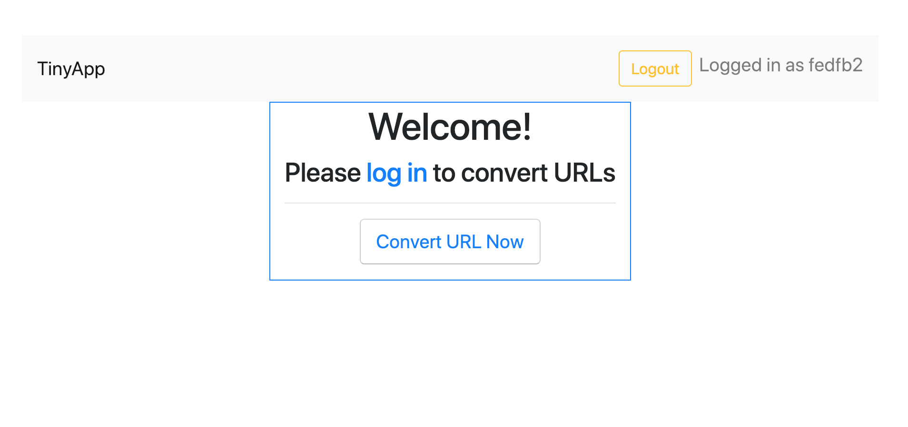
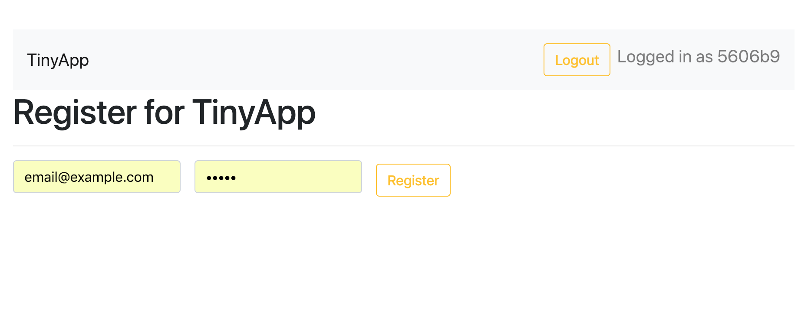
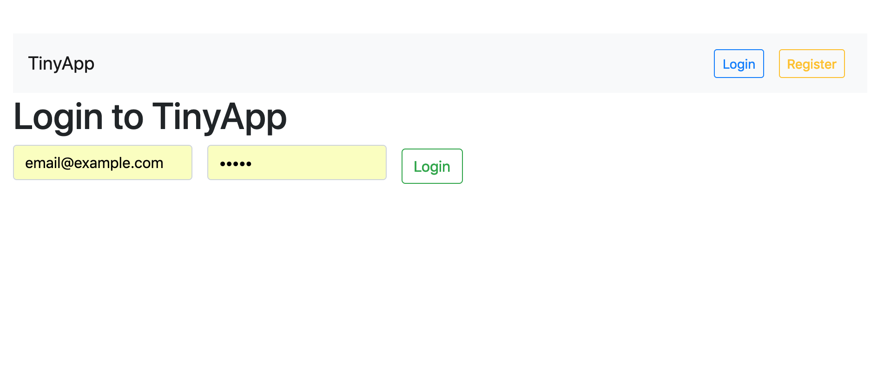
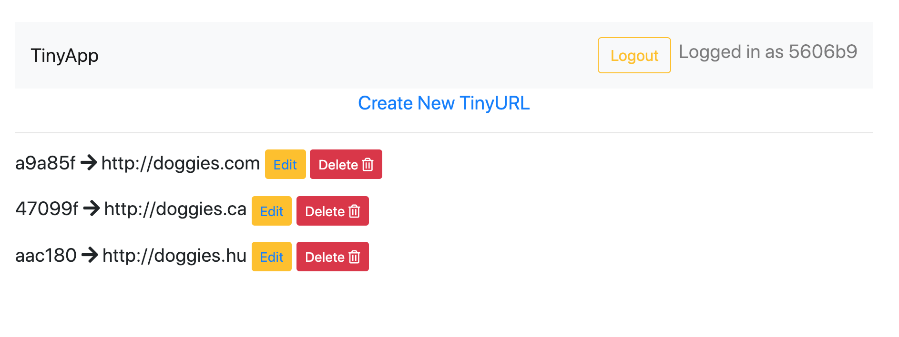
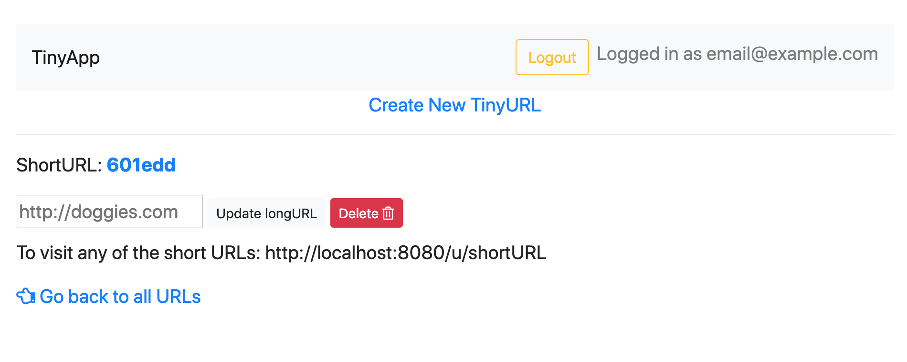

# TinyApp Project

A url-shortener app

## Getting Started

This project was created to shorten URLs

### Prerequisites

What you need to install:

```
express
ejs
body-parser
cookie-sessions
... and more

```

### Installing

Clone project and make sure to install all dependencies. 

## Running the tests

No tests added to this project

## Deployment

Please do not deploy

## Versioning

TinyApp version 1.0.0

## Authors

* Danila Barton-Szabo - initial author


## License

This project is licensed under the LHL License
## Acknowledgments

* To all libraries that were used to create this project
* Mentors who double-checked my code and helped through the tough spots
* Fellow peers for offering their support

## App Flow

* Landing page:



* Registration page:



* Login page:



* URLs Index Page



* Edit URLs Page
